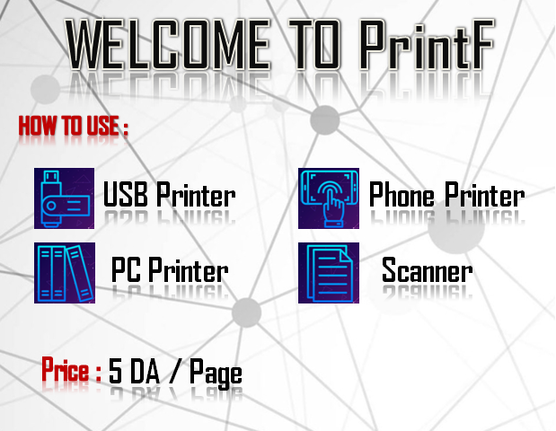

# Public Printer
 Project that provides printing services in public places
 
 # Demo
 Click on the link to see the full Demo:
https://www.facebook.com/watch/?v=144614316492188
 
 
 # Description
Public printer consists of three parts, a Python application for controlling, a printer to execute printing services and a payment system using RFID cards reader based on Arduino board. 
Basically, this project was designed to be used in universities and public libraries in order to provide many services for customers such as: printing using USB drive, printing copies, printing courses and files from system's database .. ect

Project done on: 19/08/2018
